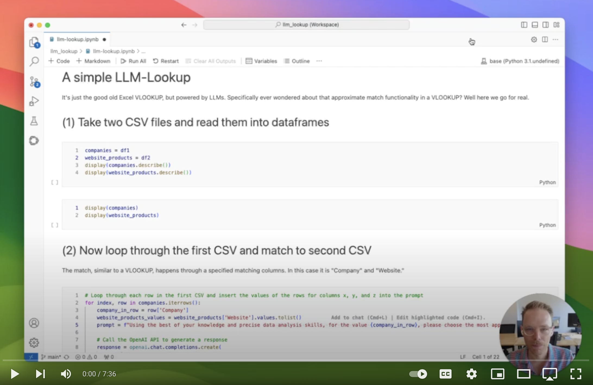

# llmlookup

## Excel's vlookup, but powered by LLMs
Ever wondered about that approximate match functionality in a vlookup? Well here we go for real. It's just the good old Excel vlookup, but powered by LLMs.

## Demo

See the [Jupyter notebook](llm-lookup.ipynb)for a walkthrough. Alternatively, also a video on YouTube:

[](https://www.youtube.com/watch?v=CCQM-UvqlY0&t=13s)

## Calling the lookup function

Call the function as follows:

```python
from llm_lookup import lookup

result = lookup(
    table1, # Pandas dataframe, required
    table2, # Pandas dataframe, required
    column_in_table1, # string, required
    column_in_table2, # string, required
    matching_context='', # string, optional
    openai_model='gpt-3.5-turbo', # string, optional
    temperature=0.1, # float, optional
    chunk_size=50, # int, optional
    return_stats=False # bool, optional
)
```

The optional parameters allow you to adjust the lookup for more tailored needs. You can choose the additional context, model, temperature, chunk size and whether or not to return stats on the lookup calls. The model, temperature and chunk size are an interplay that strongly depend on one another and the dataset given. Worth testing on a smaller data set and finetuning to see what works best for needs.


## Setup

To use the lookup function, follow these steps:

1. **Update API keys**: Make sure you have the OpenAI API key set as an environment variable `OPENAI_API_KEY`. Test this by running the below in your Terminal, otherwise modify the code as need be:
```python
export OPENAI_API_KEY="your_api_key"
```
2. **Read files into Pandas dataframes**: Use Pandas to read files into a dataframe. The Pandas dataframes are being used to process the lookup. You can use the following function to read a CSV:
```python
dataframe = pd.read_csv(file_path)
```
